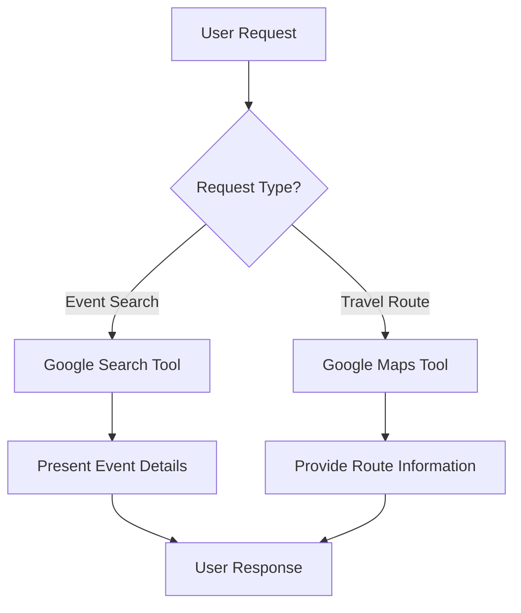

# Social Event Agent with Travel Planning

A Google ADK-powered intelligent agent that helps users discover social events in specific cities and provides optimized travel routes to those events.

## Overview

The **Social Event Agent** combines event discovery with intelligent travel planning. It leverages Google Search to find relevant social events and Google Maps to provide optimized routes, making it easy for users to plan their social activities.

## Features

- 🎉 **Event Discovery**: Search for social events in any city within a specific date range
- 🗺️ **Travel Planning**: Get optimized routes and directions to events
- 🚗 **Multi-Modal Transportation**: Support for driving, walking, transit, and other modes
- ⚡ **Real-Time Traffic**: Consider traffic conditions for route optimization
- 📍 **Multi-Stop Itineraries**: Plan routes to multiple events efficiently

## Architecture

### Core Components

#### Agent Configuration
- **Model**: `gemini-2.0-flash-exp`
- **Name**: `social_event_agent`
- **Tools**: Google Search, Google Maps Grounding

#### Tools Integration

The agent uses two primary tools:

1. **`google_search`**: Discovers social events based on city and date criteria
2. **`google_maps_grounding`**: Provides route optimization and travel directions

### How It Works



## Usage

### Prerequisites

- Python 3.8+
- Google ADK installed
- Valid API credentials in `.env` file

### Setup

1. Install dependencies:
```bash
pip install google-adk
```

2. Configure your environment variables in `.env`:
```
GOOGLE_API_KEY=your_api_key_here
```

3. Run the agent:
```bash
adk run agent_3
```

### Example Interactions

#### Finding Events
```
User: "What social events are happening in San Francisco this weekend?"

Agent: [Uses google_search to find events and presents:
- Event name
- Date and time
- Location
- Brief description]
```

#### Getting Directions
```
User: "How do I get to the concert at Golden Gate Park from downtown?"

Agent: [Uses google_maps_grounding to provide:
- Travel time and distance
- Recommended transportation mode
- Step-by-step directions
- Alternative routes]
```

#### Multi-Event Planning
```
User: "I want to attend three events today. Can you plan the best route?"

Agent: [Provides optimized multi-stop itinerary with routes between events]
```

## Agent Capabilities

### Event Search
- Finds events based on city and date range
- Provides comprehensive event details
- Handles cases where no events are found gracefully

### Travel Planning
- Optimizes routes based on starting location
- Considers traffic conditions
- Supports multiple transportation modes
- Provides alternative routes when available
- Creates multi-stop itineraries for multiple events

### Error Handling
- Politely informs users when tools return errors
- Suggests alternatives when no results are found
- Requests missing information (e.g., starting location) when needed

## Project Structure

```
Agent_3/
├── agent_3.py          # Main agent definition and configuration
├── __init__.py         # Package initialization
├── .env                # Environment variables (API keys)
└── README.md           # This file
```

## Key Design Decisions

### Why These Tools?

- **Google Search**: Provides real-time, comprehensive event information from across the web
- **Google Maps Grounding**: Offers accurate, traffic-aware routing with multiple transportation options

### Agent Instructions

The agent is designed with clear, structured instructions that:
- Define specific workflows for event search vs. travel planning
- Ensure all necessary information is collected from users
- Handle edge cases and errors gracefully
- Provide detailed, actionable responses

## Future Enhancements

Potential improvements for this agent:

- 🎫 **Ticket Integration**: Link to ticket purchasing platforms
- 📅 **Calendar Integration**: Add events directly to user calendars
- 💰 **Budget Planning**: Estimate costs for events and travel
- 👥 **Group Coordination**: Help coordinate events for multiple people
- 🌤️ **Weather Integration**: Consider weather in event recommendations

## Contributing

To extend this agent:

1. Add new tools in the `tools` list
2. Update the agent's `instruction` to incorporate new capabilities
3. Test thoroughly with various user queries

## License

This project is built using Google ADK. Please refer to Google's terms of service for usage guidelines.

## Support

For issues or questions:
- Check the Google ADK documentation
- Review the agent's instruction set in `agent_3.py`
- Ensure all environment variables are properly configured
